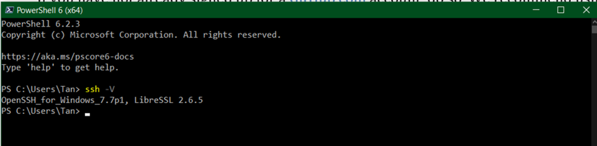
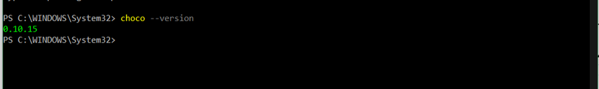
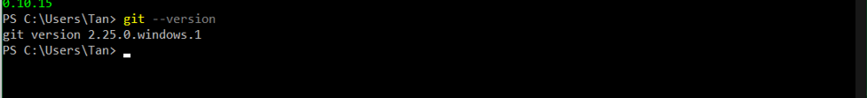
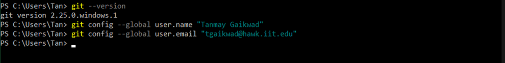
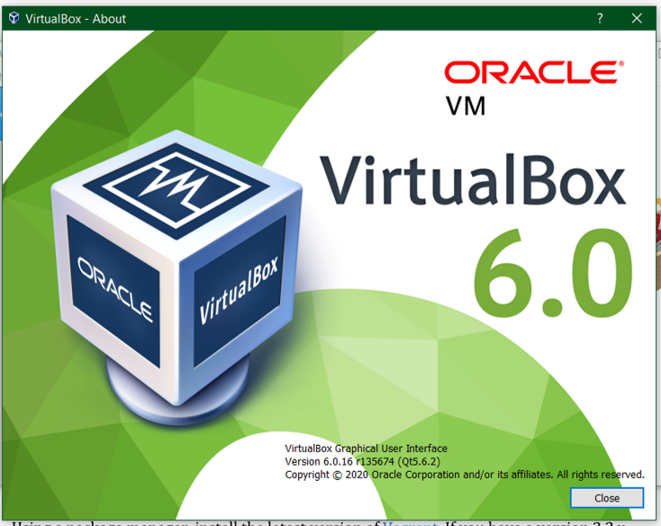
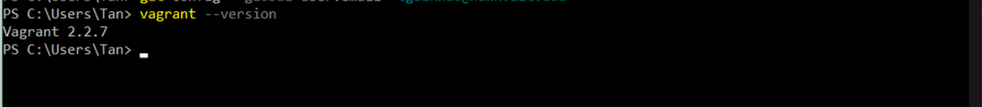
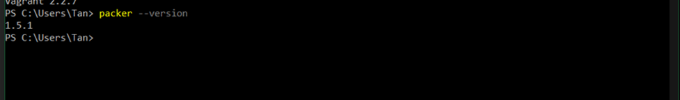
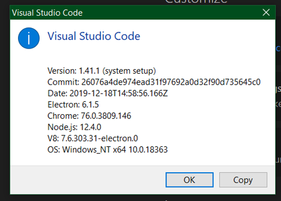
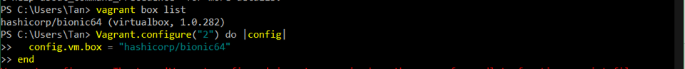
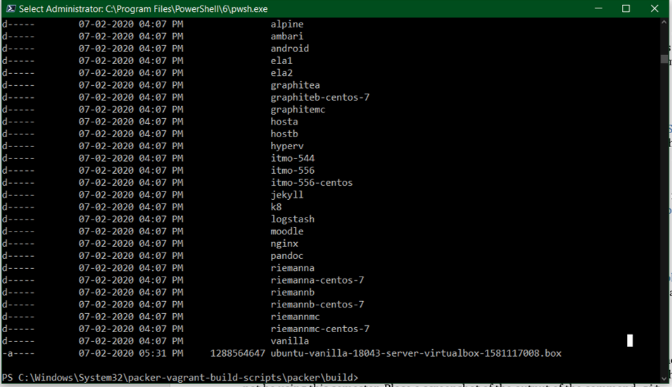

# TANMAY GAIKWAD

## Where are you from?

From Pune, Maharashtra, India.

## IT Interest

My experience is in telecom, but i had done some managerial work at my previous workplace like training and leading a small team of telecom tech support engineers. However, the slowing rate of growth in the Telecom industry within my country lead me to sought out other options. Since tech had been my interest all along, I chose to dive into the world of IT with my graduate program at IIT. 

## Something Interesting About You

I love cars. So much so that even the fictional miniature models intrigue me, especially the Hotwheels car models. Within the past twenty years, i have grown my collection of these Hotwheels cars to around 300. 

## Git-IT Tutorial Badge

## Screenshots-

### Installation of PowerShell Core for Windows: 

### Chocolatey version:

### GIT version:

### GIT commands:

### VirtualBox version:

### Vagrant version:

### Packer version:

### Visual Code version:

### Box created:

### Build directory showing *.box file:

